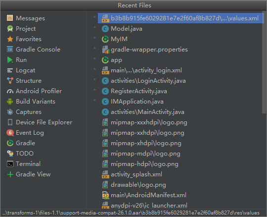
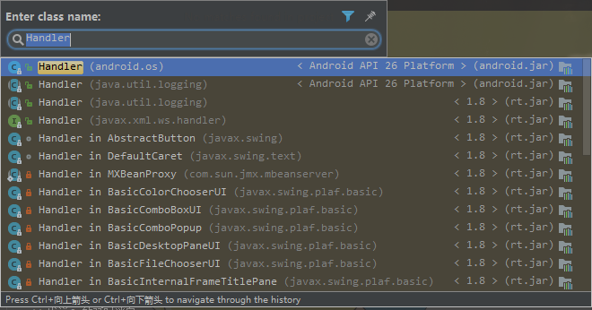
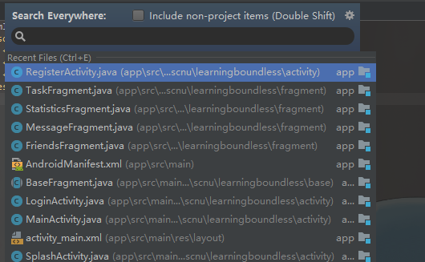
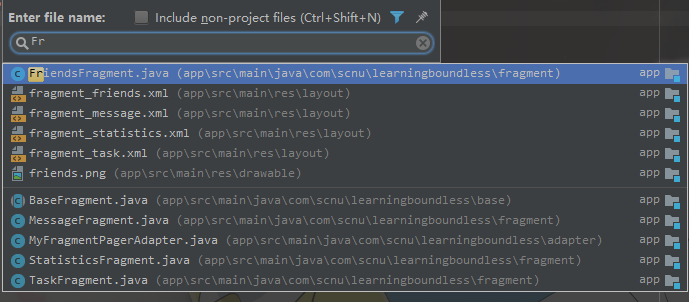

> **注**：
>
> 在下文中，使用AS代指Android Studio。

## 一. 用好快捷键

### 1. Ctrl + E（显示最近编辑的文件列表） 

项目一大，文件一多，每次coding的时候就必须在多个不同文件之间来回切换，而且切换的目标文件一般都是你之前或者最近使用的文件。不管你是直接在项目结构视图切换到目标文件，亦或是在编辑器视图上方的Tab页切换到目标文件，都很不方便。此时，你可以直接在AS中键入**Ctrl + E**，进入“最近编辑的文件列表” 视图，简易切换到你的目标文件。如下：

 

### 2. Ctrl + N（快速查找类）

有时，我们需要查看某个类的源码实现；或者，在某些类冲突的时候，想要查重，都可以在AS中键入**Ctrl + N**，在弹出的输入框中输入你所要查询的类名，点击查询到的某一列表项就可以跳转到目标类的源码了。如下：

 

### 3. Shift + Shift（快速查找任何东西）

 

### 4. Ctrl + Shift + N（快速查找文件）

 

***

## 二. 利用好AS的代码智能化提示

### 1. 输入 fvb + 回车

=>  `findViewById();`

 

### 2. 输入 logt + 回车

=> `private static final String TAG = "当前类名";`

 
### 3. 输入